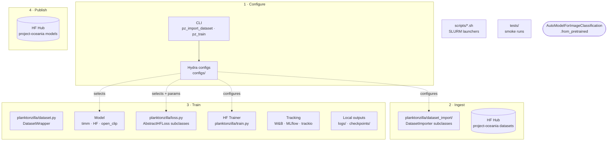

<div align="center">

# 🪸 🦠 🪼 🦐 🦖 🐙 🫧 🌊<br/>`planktonzilla`

Multimodal deep learning framework, datasets, and models for plankton identification.

**Part of [Inria Challenge OcéanIA](https://oceania.inria.cl/).**

[](https://www.python.org)


[](https://hydra.cc/)
[](https://github.com/astral-sh/uv)
[](https://github.com/astral-sh/ruff)

[](https://doi.org/10.48550/arXiv.2606.00080)
[](LICENSE)

</div>

`planktonzilla` is a framework for managing datasets, training computer vision models, and evaluating performance on various plankton image identification tasks. Built on top of Hugging Face Transformers and Hydra for configuration management, it offers specialized tools for handling imbalanced plankton datasets and state-of-the-art imbalance learning loss functions.

## Online Resources

- `planktonzilla-17M` dataset: 17 million plankton images from 9 different datasets, all standardized and preprocessed for deep learning applications. Available: <https://huggingface.co/datasets/project-oceania/planktonzilla-17m>.
- OcéanIA project website: <https://oceania.inria.cl>.
- OcéanIA on Hugging Face Hub (datasets, trained models, and demos): <https://huggingface.co/project-oceania>.

## Citation

If you use Planktonzilla in your research, please cite as:

> A. G. Contreras Montanares, L. Valenzuela, L. Martí, and N. Sanchez‑Pi, **Planktonzilla: Multimodal dataset and models
for understanding plankton ecosystems,** Inria Chile Research Center, Tech. Rep., May 2026,
doi: [10.48550/arXiv.2606.00080](https://doi.org/10.48550/arXiv.2606.00080), arXiv: 2606.00080 [cs.CV]. url: <https://arxiv.org/abs/2606.00080>

```bibtex
@techreport{contrerasmontanares:hal-05621003,
  title         = {Planktonzilla: {M}ultimodal dataset and models for understanding plankton ecosystems},
  author        = {Contreras Montanares, Alan Gerson and Valenzuela, Luis and Mart{\'i}, Luis and Sanchez-Pi, Nayat},
  year          = 2026,
  month         = {May},
  keywords      = {Explainable AI; XAI ; Plankton Classification ; CLIPS ; Multimodal Classification},
  eprinttype    = {arxiv},
  hal_id        = {hal-05621003},
  hal_version   = {v1},
  eprint        = {2606.00080},
  archivePrefix = {arXiv},
  primaryClass  = {cs.CV},
  url           = {https://arxiv.org/abs/2606.00080},
  doi           = {10.48550/arXiv.2606.00080},
  institution   = {Inria Chile Research Center},
}
```

## Load a pre-trained model

```python
from transformers import AutoModelForImageClassification, AutoImageProcessor
from PIL import Image

model_id = "project-oceania/<model-name>"  # see https://huggingface.co/project-oceania
processor = AutoImageProcessor.from_pretrained(model_id, trust_remote_code=True)
model = AutoModelForImageClassification.from_pretrained(model_id, trust_remote_code=True)

image = Image.open("plankton.jpg").convert("RGB")
inputs = processor(images=image, return_tensors="pt")
outputs = model(**inputs)
predicted_idx = outputs.logits.argmax(-1).item()
print(model.config.id2label[predicted_idx])
```

## Project Structure

```
planktonzilla/                          # repo root
├── configs/                            # Hydra configuration tree (bundled into wheel)
│   ├── train.yaml                      # root config for pz_train
│   ├── import_dataset.yaml             # root config for pz_import_dataset
│   ├── generate_planktonzilla.yaml     # root config for dataset generation
│   ├── update_planktonzilla.yaml       # root config for dataset update
│   ├── augmentation/                   # data augmentation strategies
│   ├── custom_loss/                    # imbalance-aware loss configs
│   ├── dataset/                        # dataset-specific configs
│   ├── dataset_import/                 # per-source import configs
│   ├── debug/                          # debug-run configs
│   ├── experiment/                     # composed experiment configs
│   ├── extras/                         # misc extras (e.g. print config tree)
│   ├── hparams_search/                 # hyperparameter-search configs
│   ├── hydra/                          # Hydra runtime (help/, launcher/ for SLURM)
│   ├── local/                          # machine-local overrides
│   ├── model/                          # model architecture configs
│   ├── paths/                          # path configs (PROJECT_ROOT etc.)
│   ├── peft/                           # LoRA / PEFT adapter configs
│   ├── tracking/                       # experiment tracking (W&B, MLflow, trackio)
│   └── training_arguments/             # HF TrainingArguments configs
├── planktonzilla/                      # main package
│   ├── train.py                        # pz_train entry point (HF Trainer pipeline)
│   ├── dataset.py                      # DatasetWrapper: load/split/transform
│   ├── loss.py                         # imbalance-aware loss functions
│   ├── clip_model.py                   # ClipClassifier (open_clip encoder + head)
│   ├── dataset_import/                 # pz_import_dataset entry point + DatasetImporter subclasses
│   │   └── public_data/                # bundled source-dataset metadata
│   ├── clip_train/                     # SLURM contrastive CLIP pretraining (main.py, train.py)
│   ├── open_clip_ext/                  # forward-compat seam around open_clip factory/transform
│   │   └── model_configs/              # open_clip model JSON configs
│   ├── planktonzilla_dataset/          # builds the master composite dataset from external sources
│   │   ├── generate_planktonzilla.py        # main dataset build (Hydra entry)
│   │   ├── gen_planktonzilla_only_plankton.py
│   │   ├── update_planktonzilla.py          # incremental dataset update (Hydra entry)
│   │   ├── save_planktonzilla_for_clip.py   # export to WebDataset for CLIP
│   │   ├── generate_sankey.py               # taxonomy Sankey diagram
│   │   ├── constants.py                     # shared constants
│   │   ├── planktonzilla_taxonomy.csv       # taxonomy mapping table
│   │   └── utils/                            # extract_cox.py, extract_taxon_ids.py, KNOWN_ISSUES.md
│   └── utils/                           # hydra.py, resolvers.py, logger.py, rich_utils.py
├── scripts/                            # train.sh, train_clip.sh, push_dataset.sh (SLURM launchers)
└── tests/                              # pytest suite (mocks all network)
```

### Prerequisites

- Python 3.11-3.14
- [uv](https://docs.astral.sh/uv/getting-started/installation/) for dependency management
- CUDA-compatible GPU (recommended for training)

### Installation

```bash
# Clone the repository
git clone https://github.com/Inria-Chile/planktonzilla.git
cd planktonzilla

# Install dependencies (creates .venv automatically)
uv sync

# Install with development dependencies
uv sync --group dev

# Activate the virtual environment (optional — `uv run` works without it)
source .venv/bin/activate
```

`uv run <command>` runs any project script inside the project venv without needing
to activate it manually. If you prefer an activated shell, run
`source .venv/bin/activate`.

### Import a public dataset as a Hugging Face dataset

```bash
# Import ISIISNET dataset
uv run pz_import_dataset dataset_import=isiisnet

# Import other available datasets
uv run pz_import_dataset dataset_import=flowcamnet
uv run pz_import_dataset dataset_import=lensless
```

### Train a model

```bash
# Basic training with default configuration
uv run pz_train

# Train with specific dataset and model
uv run pz_train dataset=isiisnet model=resnet18

# Use specialized loss for imbalanced data
uv run pz_train dataset=isiisnet model=resnet50 custom_loss=focal

# Override training parameters
uv run pz_train dataset=isiisnet model=resnet18 training_arguments.num_train_epochs=10 training_arguments.learning_rate=1e-4
```

### Configuration system

Planktonzilla uses Hydra for hierarchical configuration management. You can override any configuration parameter:

```bash
# Use different model architecture
uv run pz_train model=efficientnet

# Apply different augmentation strategy
uv run pz_train augmentation=autoaugment

# Combine multiple overrides
uv run pz_train dataset=isiisnet model=resnet50 custom_loss=ldam training_arguments.learning_rate=1e-4
```

### Architecture

The training pipeline composes Hydra-configured datasets, models, and losses through the Hugging Face `Trainer`, then publishes the resulting checkpoint to the Hub — where external users load it with `AutoModelForImageClassification.from_pretrained`.



- **ISIISNET**: In-Situ Ichthyoplankton Imaging System Network
- **FlowCamNet**: FlowCam plankton dataset
- **Lensless**: Lensless plankton microscopy dataset
- **UVP6Net**: Underwater Vision Profiler 6 dataset
- **WHOI-Plankton**: Woods Hole Oceanographic Institution plankton dataset
- **ZooLake**: Lake Greifensee (Switzerland) zooplankton dataset
- **ZooScanNet**: ZooScan plankton dataset
- **JEDI-Oceans**: JEDI oceanic plankton dataset
- **CIFAR-10**: Generic image classification benchmark (sanity-check / smoke-test runs)

### Loss functions for imbalanced learning

Planktonzilla includes specialized loss functions designed for imbalanced plankton classification:

- **FocalLoss**: Addresses class imbalance through dynamic loss weighting
- **LDAMLoss**: Label-Distribution-Aware Margin loss
- **AsymmetricLoss**: For multi-label classification scenarios
- **RobustAsymmetricLoss**: Enhanced version of asymmetric loss
- **MaximumMarginLoss**: Margin-based learning approach
- **BalancedMetaSoftmaxLoss**: Meta-learning approach for class balance

### Experiment tracking

Integrate with popular experiment tracking tools:

```bash
# Enable Weights & Biases tracking
uv run pz_train tracking.use_wandb=true

# Enable MLflow tracking
uv run pz_train tracking.use_mlflow=true

# Enable Trackio
uv run pz_train tracking.use_trackio=true
```

### Development

#### Running Tests

```bash
# Run all tests
uv run pytest

# Run with coverage
uv run pytest --cov=planktonzilla

# Run specific test file
uv run pytest tests/test_datasets.py
```

#### Code Quality

```bash
# Lint code
uv run ruff check

# Format code
uv run ruff format
```

#### Adding New Datasets

1. Create a dataset configuration in `configs/dataset/your_dataset.yaml`
2. Ensure your dataset is available on Hugging Face Hub
3. Test with: `uv run pz_train dataset=your_dataset`

#### Custom Loss Functions

1. Implement your loss class inheriting from `AbstractHFLoss` in `planktonzilla/loss.py`
2. Add configuration file in `configs/custom_loss/your_loss.yaml`  
3. Loss functions must handle `ImageClassifierOutputWithNoAttention` input format
4. Test with: `uv run pz_train custom_loss=your_loss`


<div align="center">
  <strong>Built with ❤️ by <a href="https://inria.cl/">Inria</a>.</strong>
</div>
