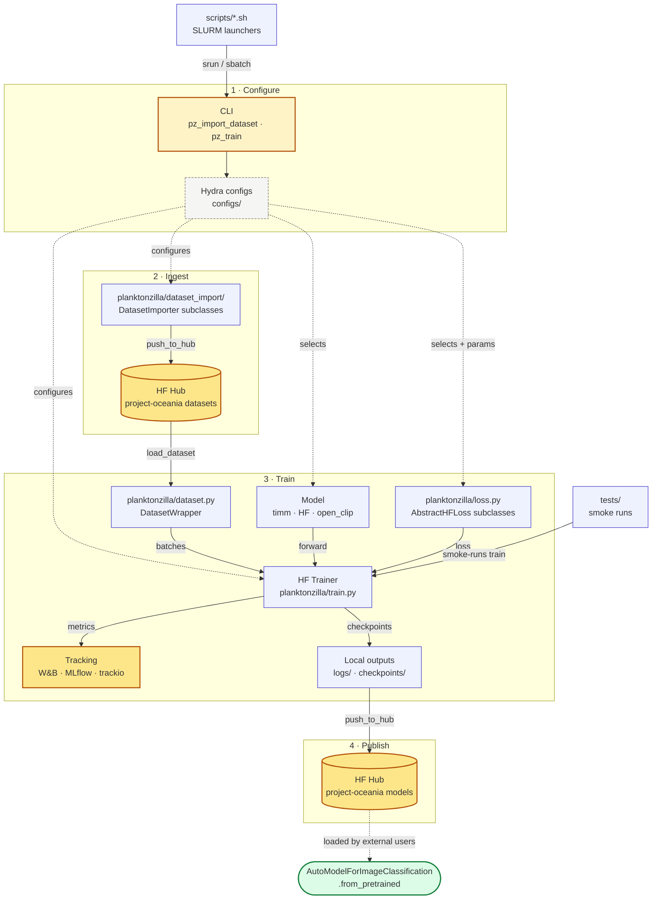

<div align="center">
<!--  -->

# 🪸 🦠 🪼 🦐 🦖 🐙 🫧 🌊<br/>`planktonzilla`

Deep learning framework, datasets, and models for plankton identification.

**Part of [Inria Challenge OcéanIA](https://oceania.inria.cl/).**

[](https://www.python.org)
[](https://pytorch.org/get-started/locally/)


[](https://hydra.cc/)


</div>

Curated, citable pre-trained plankton-classification models on Hugging Face Hub — load one and run inference on plankton images in under ten lines of Python.

- OcéanIA project website: <https://oceania.inria.cl>.
- OcéanIA on Hugging Face Hub (datasets, trained models, and demos): <https://huggingface.co/project-oceania>.

## Load a pre-trained model

The published planktonzilla models are landing in the v1 release. The snippet below is the target API every v1 model will conform to — a single universal `from_pretrained` call that works for the entire model collection, no clone of this repository required.

```python
from transformers import AutoModelForImageClassification, AutoImageProcessor
from PIL import Image

model_id = "project-oceania/<model-name>"  # see https://huggingface.co/project-oceania
processor = AutoImageProcessor.from_pretrained(model_id, trust_remote_code=True)
model = AutoModelForImageClassification.from_pretrained(model_id, trust_remote_code=True)

image = Image.open("plankton.jpg").convert("RGB")
inputs = processor(images=image, return_tensors="pt")
outputs = model(**inputs)
predicted_idx = outputs.logits.argmax(-1).item()
print(model.config.id2label[predicted_idx])
```

- Browse published models: <https://huggingface.co/project-oceania>
- No clone of this repo is required — `pip install transformers pillow` is the consumer dependency surface.
- v1 status: pre-trained models are being prepared for release; see [project status](https://oceania.inria.cl/) and the HF org page above for current availability.

## Features

- **Modular Configuration**: Hydra-based hierarchical configuration.
- **Multiple Plankton Dataset Support**: Built-in support for all (afawk) plankton image datasets.
- **Specialized Loss Functions to handle class imbalance**: Advanced loss functions for imbalanced classification (Focal, LDAM, Asymmetric, etc.)
- **Model Hub Integration**: Seamless integration with Hugging Face Hub for model sharing
- **Experiment Tracking**: Built-in support for Weights & Biases, MLflow, and Trackio.
- **Flexible Training Pipeline**: Based on Hugging Face Transformers Trainer with custom enhancements.
- **Easy CLI Interface**: Simple command-line tools for all operations.

## Supported datasets

The values below are the keys to pass as `dataset_import=<key>` to `pz_import_dataset` (see `configs/dataset_import/`).

- `flowcamnet` — FlowCam plankton dataset
- `global_uvp5net` — Global Underwater Vision Profiler 5 dataset
- `isiisnet` — In-Situ Ichthyoplankton Imaging System Network
- `jedi_oceans_cpics` — JEDI Systems Oceans CPICS plankton dataset
- `lensless` — Lensless plankton microscopy dataset
- `medplanktonset` — Mediterranean plankton image set
- `planktonset1` — PlanktonSet 1 image collection
- `planktoscope` — PlanktoScope plankton imager dataset
- `syke_ifcb_2022` — SYKE Imaging FlowCytobot 2022 dataset
- `sykezooscan2024` — SYKE ZooScan 2024 dataset
- `uvp6net` — Underwater Vision Profiler 6 dataset
- `whoi-plankton` — Woods Hole Oceanographic Institution plankton dataset
- `zoocamnet` — ZooCam plankton dataset
- `zoolake` — Lake Zurich zooplankton dataset
- `zooscannet` — ZooScan plankton dataset

## License

This project is released under the MIT License — see the [LICENSE](LICENSE) file. Individual model and dataset releases on Hugging Face Hub declare their own licenses, which may inherit constraints from the source dataset's license; check the model card before redistribution or commercial use.

---

## For maintainers / Train your own model

Everything below is for contributors and researchers who want to train new models or extend the framework. Consumers loading a published model do not need any of it.

### Prerequisites

- Python 3.11-3.14
- [Poetry](https://python-poetry.org/docs/#installation) for dependency management
- CUDA-compatible GPU (recommended for training)

### Installation

```bash
# Clone the repository
git clone https://github.com/Inria-Chile/planktonzilla.git
cd planktonzilla

# Install dependencies
poetry install

# Install with development dependencies
poetry install --with dev

# Activate the virtual environment
poetry shell
```

### Import a dataset

```bash
# Import ISIISNET dataset
poetry run pz_import_dataset dataset_import=isiisnet

# Import other available datasets
poetry run pz_import_dataset dataset_import=flowcamnet
poetry run pz_import_dataset dataset_import=lensless
```

### Train a model

```bash
# Basic training with default configuration
poetry run pz_train

# Train with specific dataset and model
poetry run pz_train dataset=isiisnet model=resnet18

# Use specialized loss for imbalanced data
poetry run pz_train dataset=isiisnet model=resnet50 custom_loss=focal

# Override training parameters
poetry run pz_train dataset=isiisnet model=resnet18 training_arguments.num_train_epochs=10 training_arguments.learning_rate=1e-4
```

### Project structure

```text
planktonzilla/
├── configs/                    # Hydra configuration files
│   ├── dataset/               # Dataset-specific configs
│   ├── model/                 # Model architecture configs  
│   ├── training_arguments/    # Training hyperparameters
│   ├── augmentation/          # Data augmentation strategies
│   ├── custom_loss/           # Loss function configurations
│   └── tracking/              # Experiment tracking setup
├── planktonzilla/             # Main package
│   ├── dataset.py             # Dataset loading and preprocessing
│   ├── train.py               # Training pipeline
│   ├── loss.py                # Custom loss functions
│   ├── dataset_import/        # Dataset import utilities
│   └── utils/                 # Logging, Hydra helpers
└── tests/                     # Test suite
```

### Configuration system

Planktonzilla uses Hydra for hierarchical configuration management. You can override any configuration parameter:

```bash
# Use different model architecture
poetry run pz_train model=efficientnet

# Apply different augmentation strategy
poetry run pz_train augmentation=autoaugment

# Combine multiple overrides
poetry run pz_train dataset=isiisnet model=resnet50 custom_loss=ldam training_arguments.learning_rate=1e-4
```

### Architecture

The training pipeline composes Hydra-configured datasets, models, and losses through the Hugging Face `Trainer`, then publishes the resulting checkpoint to the Hub — where external users load it with `AutoModelForImageClassification.from_pretrained`.



### Loss functions for imbalanced learning

Planktonzilla includes specialized loss functions designed for imbalanced plankton classification:

- **FocalLoss**: Addresses class imbalance through dynamic loss weighting
- **LDAMLoss**: Label-Distribution-Aware Margin loss
- **AsymmetricLoss**: For multi-label classification scenarios
- **RobustAsymmetricLoss**: Enhanced version of asymmetric loss
- **MaximumMarginLoss**: Margin-based learning approach
- **BalancedMetaSoftmaxLoss**: Meta-learning approach for class balance

### Experiment tracking

Integrate with popular experiment tracking tools:

```bash
# Enable Weights & Biases tracking
poetry run pz_train tracking.use_wandb=true

# Enable MLflow tracking  
poetry run pz_train tracking.use_mlflow=true
```

### Development

#### Running Tests

```bash
# Run all tests
poetry run pytest

# Run with coverage
poetry run pytest --cov=planktonzilla

# Run specific test file
poetry run pytest tests/test_datasets.py
```

#### Code Quality

```bash
# Lint code
poetry run ruff check

# Format code
poetry run ruff format
```

#### Adding New Datasets

1. Create a dataset configuration in `configs/dataset/your_dataset.yaml`
2. Ensure your dataset is available on Hugging Face Hub
3. Test with: `poetry run pz_train dataset=your_dataset`

#### Custom Loss Functions

1. Implement your loss class inheriting from `AbstractHFLoss` in `planktonzilla/loss.py`
2. Add configuration file in `configs/custom_loss/your_loss.yaml`  
3. Loss functions must handle `ImageClassifierOutputWithNoAttention` input format

## 🤝 Contributing

We welcome contributions to Planktonzilla! Please feel free to:

- Report bugs and request features via [GitHub Issues](https://github.com/Inria-Chile/deep_plankton/issues)
- Submit pull requests for improvements
- Add new datasets or model architectures
- Improve documentation

## 📞 Support

- **Homepage**: [https://oceania.inria.cl/](https://oceania.inria.cl/)
- **Issues**: [GitHub Issues](https://github.com/Inria-Chile/deep_plankton/issues)
- **Email**: [info@inria.cl](mailto:info@inria.cl)

---

<div align="center">
  <strong>Built with ❤️ by <a href="https://oceania.inria.cl/">Inria Chile</a></strong>
</div>
