<div align="center">

# 🪸 🦠 🪼 🦐 🦖 🐙 🫧 🌊<br/>`planktonzilla`

Multimodal deep learning framework, datasets, and models for plankton identification.

**Part of [Inria Challenge OcéanIA](https://oceania.inria.cl/).**

[](https://www.python.org)
[](https://pytorch.org/get-started/locally/)


[](https://hydra.cc/)
[](https://github.com/astral-sh/uv)


</div>

`planktonzilla` is a framework for managing datasets, training computer vision models, and evaluating performance on various plankton image identification tasks. Built on top of Hugging Face Transformers and Hydra for configuration management, it offers specialized tools for handling imbalanced plankton datasets and state-of-the-art imbalance learning loss functions.

*Highlights:*

- `planktonzilla-17M` dataset: 17 million plankton images from 9 different datasets, all standardized and preprocessed for deep learning applications. Available: <https://huggingface.co/datasets/project-oceania/planktonzilla-17m>.

- OcéanIA project website: <https://oceania.inria.cl>.
- OcéanIA in Hugging Face hub (datasets, trained models and demos): <https://huggingface.co/project-oceania>.

## Features

- **Modular Configuration**: Hydra-based hierarchical configuration.
- **Multiple Plankton Dataset Support**: Built-in support for all (afawk) plankton image datasets.
- **Specialized Loss Functions to handle class imbalance**: Advanced loss functions for imbalanced classification (Focal, LDAM, Asymmetric, etc.)
- **Model Hub Integration**: Seamless integration with Hugging Face Hub for model sharing
- **Experiment Tracking**: Built-in support for Weights & Biases, MLFlow, and Trackio.
- **Flexible Training Pipeline**: Based on Hugging Face Transformers Trainer with custom enhancements.
- **Easy CLI Interface**: Simple command-line tools for all operations.

```mermaid
flowchart LR
  %% ── Configuration (shared across both pipelines) ─────────────────
  subgraph CFG_GRP["⚙️ Hydra Config Tree (configs/)"]
    direction TB
    CFG_TRAIN[train.yaml]
    CFG_IMPORT[import_dataset.yaml]
    CFG_MODEL[model/]
    CFG_DATA[dataset/]
    CFG_AUG[augmentation/]
    CFG_LOSS[custom_loss/]
    CFG_PEFT[peft/ — LoRA]
    CFG_HPARAM[hparams_search/ — Optuna]
    CFG_TRACK[tracking/]
    CFG_TRAIN_ARGS[training_arguments/]
  end

  %% ── Stage 1: Data Ingestion ──────────────────────────────────────
  subgraph INGEST["📥 Data Ingestion · pz_import_dataset"]
    direction LR
    RAW[Raw plankton sources<br/>WHOI / EcoTaxa / public]
    IMPORTER[dataset_import/<br/>dataset_importer.py]
    PUSH_DS[push to HF Hub]
    RAW --> IMPORTER --> PUSH_DS
  end

  %% ── Stage 2: Training & Evaluation ───────────────────────────────
  subgraph TRAIN["🏋️ Training · pz_train"]
    direction TB
    DATA[dataset.py<br/>+ augmentation pipeline]
    MODEL_HF[HF / timm classifier]
    MODEL_CLIP[clip_model.py<br/>OpenCLIP backbone]
    LOSS[loss.py · custom losses]
    PEFT_ADAPT[PEFT / LoRA adapters]
    TRAINER[HF Trainer loop]
    HPARAM[Optuna sweep<br/>optional]
    DATA --> TRAINER
    MODEL_HF --> TRAINER
    MODEL_CLIP --> TRAINER
    LOSS --> TRAINER
    PEFT_ADAPT --> TRAINER
    HPARAM -.->|trials| TRAINER
  end

  %% ── Outputs ──────────────────────────────────────────────────────
  HF_HUB[(🤗 HF Hub<br/>datasets · checkpoints)]
  TRACK_BE[W&B · MLflow · Trackio]
  LOGS[logs/ · checkpoints/<br/>wandb/]

  %% ── Orchestration ────────────────────────────────────────────────
  subgraph ORCH["🛰️ Orchestration"]
    direction TB
    SLURM[scripts/*.sh<br/>SLURM · torchrun multi-node]
    DEVCT[.devcontainer/<br/>CUDA 12.5 · Python 3.12]
    TESTS[tests/ · pytest]
  end

  %% ── Wiring ───────────────────────────────────────────────────────
  CFG_GRP -. merged config .-> INGEST
  CFG_GRP -. merged config .-> TRAIN

  PUSH_DS --> HF_HUB
  HF_HUB -->|load_dataset| DATA

  TRAINER -->|metrics| TRACK_BE
  TRAINER -->|checkpoints + logs| LOGS
  TRAINER -.->|push_to_hub| HF_HUB

  SLURM -->|launch| INGEST
  SLURM -->|launch| TRAIN
  DEVCT -.->|env for| TRAIN
  TESTS -.->|validate| TRAIN

  classDef hub fill:#fef3c7,stroke:#d97706,stroke-width:2px
  classDef cfg fill:#e0e7ff,stroke:#4338ca
  class HF_HUB hub
  class CFG_GRP cfg
```



### 📁 Project Structure

```
planktonzilla/
├── configs/                    # Hydra configuration files
│   ├── dataset/               # Dataset-specific configs
│   ├── model/                 # Model architecture configs  
│   ├── training_arguments/    # Training hyperparameters
│   ├── augmentation/          # Data augmentation strategies
│   ├── custom_loss/           # Loss function configurations
│   └── tracking/              # Experiment tracking setup
├── planktonzilla/             # Main package
│   ├── dataset.py             # Dataset loading and preprocessing
│   ├── train.py               # Training pipeline
│   ├── loss.py                # Custom loss functions
│   ├── clip_model.py          # CLIP-based model wrapper
│   ├── dataset_import/        # Dataset import utilities
│   └── utils/                 # Logging, Hydra helpers
└── tests/                     # Test suite
```

## Quick Start

### Prerequisites

- Python 3.11-3.14
- [uv](https://docs.astral.sh/uv/getting-started/installation/) for dependency management
- CUDA-compatible GPU (recommended for training)

### Installation

```bash
# Clone the repository
git clone https://github.com/Inria-Chile/deep_plankton.git
cd planktonzilla

# Install dependencies (creates .venv automatically)
uv sync

# Install with development dependencies
uv sync --group dev

# Activate the virtual environment (optional — `uv run` works without it)
source .venv/bin/activate
```

### Basic Usage

#### 1. Import a Dataset

```bash
# Import ISIISNET dataset
uv run pz_import_dataset dataset_import=isiisnet

# Import other available datasets
uv run pz_import_dataset dataset_import=flowcamnet
uv run pz_import_dataset dataset_import=lensless
```

#### 2. Train a Model

```bash
# Basic training with default configuration
uv run pz_train

# Train with specific dataset and model
uv run pz_train dataset=isiisnet model=resnet18

# Use specialized loss for imbalanced data
uv run pz_train dataset=isiisnet model=resnet50 custom_loss=focal

# Override training parameters
uv run pz_train dataset=isiisnet model=resnet18 training_arguments.num_train_epochs=10 training_arguments.learning_rate=1e-4
```


## 🎯 Advanced Usage

### Configuration System

Planktonzilla uses Hydra for hierarchical configuration management. You can override any configuration parameter:

```bash
# Use different model architecture
uv run pz_train model=efficientnet

# Apply different augmentation strategy
uv run pz_train augmentation=autoaugment

# Combine multiple overrides
uv run pz_train dataset=isiisnet model=resnet50 custom_loss=ldam training_arguments.learning_rate=1e-4
```

### Supported Datasets

- **ISIISNET**: In-Situ Ichthyoplankton Imaging System Network
- **FlowCamNet**: FlowCam plankton dataset
- **Lensless**: Lensless plankton microscopy dataset
- **UVP6Net**: Underwater Vision Profiler 6 dataset
- **WHOI-Plankton**: Woods Hole Oceanographic Institution plankton dataset
- **ZooLake**: Lake Zurich zooplankton dataset
- **ZooScanNet**: ZooScan plankton dataset
- **JEDI-Oceans**: JEDI oceanic plankton dataset
- **CIFAR-10**: Generic image classification benchmark (sanity-check / smoke-test runs)

### Loss Functions for Imbalanced Learning

Planktonzilla includes specialized loss functions designed for imbalanced plankton classification:

- **FocalLoss**: Addresses class imbalance through dynamic loss weighting
- **LDAMLoss**: Label-Distribution-Aware Margin loss
- **AsymmetricLoss**: For multi-label classification scenarios
- **RobustAsymmetricLoss**: Enhanced version of asymmetric loss
- **MaximumMarginLoss**: Margin-based learning approach
- **BalancedMetaSoftmaxLoss**: Meta-learning approach for class balance

### Experiment Tracking

Integrate with popular experiment tracking tools:

```bash
# Enable Weights & Biases tracking
uv run pz_train tracking.use_wandb=true

# Enable MLflow tracking
uv run pz_train tracking.use_mlflow=true

# Enable Trackio
uv run pz_train tracking.use_trackio=true
```

## 🧪 Development

### Running Tests

```bash
# Run all tests
uv run pytest

# Run with coverage
uv run pytest --cov=planktonzilla

# Run specific test file
uv run pytest tests/test_datasets.py
```

### Code Quality

```bash
# Lint code
uv run ruff check

# Format code
uv run ruff format
```

### Adding New Datasets

1. Create a dataset configuration in `configs/dataset/your_dataset.yaml`
2. Ensure your dataset is available on Hugging Face Hub
3. Test with: `uv run pz_train dataset=your_dataset`

### Custom Loss Functions

1. Implement your loss class inheriting from `AbstractHFLoss` in `planktonzilla/loss.py`
2. Add configuration file in `configs/custom_loss/your_loss.yaml`  
3. Loss functions must handle `ImageClassifierOutputWithNoAttention` input format
4. Test with: `uv run pz_train custom_loss=your_loss`

## 🤝 Contributing

We welcome contributions to Planktonzilla! Please feel free to:

- Report bugs and request features via [GitHub Issues](https://github.com/Inria-Chile/deep_plankton/issues)
- Submit pull requests for improvements
- Add new datasets or model architectures
- Improve documentation

## 📄 License

This project is licensed under the MIT License - see the [LICENSE](LICENSE) file for details.

## 🏛️ Citation

If you use Planktonzilla in your research, please cite:

```bibtex
@software{planktonzilla,
  title={Planktonzilla: A Deep Learning Framework for Plankton Identification},
  author={Inria Chile},
  year={2024},
  url={https://github.com/Inria-Chile/deep_plankton},
  version={0.1.1}
}
```

<div align="center">
  <strong>Built with ❤️ by <a href="https://oceania.inria.cl/">Inria Chile</a></strong>
</div>
