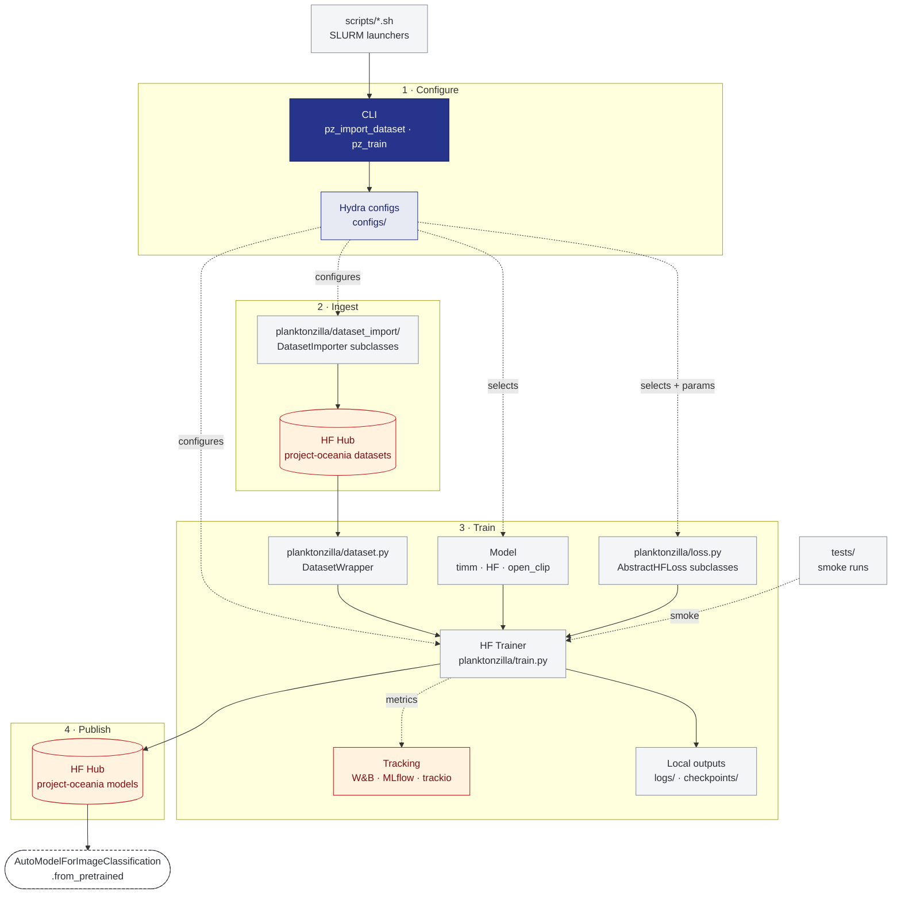

<div align="center">
<br/>

# 🪸 🦠 🪼 🦐 🦖 🐙 🫧 🌊<br/>`planktonzilla`

Multimodal deep learning framework, datasets, and models for plankton identification.

**Part of [Inria Challenge OcéanIA](https://oceania.inria.cl/).**

[](https://www.python.org)
[](https://github.com/Inria-Chile/planktonzilla/actions/workflows/ci.yml)


[](https://hydra.cc/)
[](https://github.com/astral-sh/uv)
[](https://github.com/astral-sh/ruff)

[](https://doi.org/10.48550/arXiv.2606.00080)
[](LICENSE)

</div>

`planktonzilla` is a framework for managing datasets, training computer vision models, and evaluating performance on various plankton image identification tasks. Built on top of Hugging Face Transformers and Hydra for configuration management, it offers specialized tools for handling imbalanced plankton datasets and state-of-the-art imbalance learning loss functions.

## Online Resources

- `planktonzilla-17M` dataset: 17.4 million plankton images drawn from 15 source datasets, all standardized and preprocessed for deep learning applications: [`project-oceania/planktonzilla-17M`](https://huggingface.co/datasets/project-oceania/planktonzilla-17m). To explore how those source labels map onto one taxonomy, build the Sankey locally with [`pz_sankey`](#explore-the-label-space-sankey).
- Models trained on [`project-oceania/planktonzilla-17M`](https://huggingface.co/datasets/project-oceania/planktonzilla-17m):
  - [`project-oceania/CLIP-ViT-B-16.openai-pt.planktonzilla-pt`](https://huggingface.co/project-oceania/CLIP-ViT-B-16.openai-pt.planktonzilla-pt)
  - [`project-oceania/CLIP-ViT-B-16.bioclip-pt.planktonzilla-pt`](https://huggingface.co/project-oceania/CLIP-ViT-B-16.bioclip-pt.planktonzilla-pt)
  - [`project-oceania/CLIP-ViT-L-14.bioclip2-pt.planktonzilla-pt`](https://huggingface.co/project-oceania/CLIP-ViT-L-14.bioclip2-pt.planktonzilla-pt)
  - [`project-oceania/CLIP-ViT-L-14.laion2b-pt.planktonzilla-pt`](https://huggingface.co/project-oceania/CLIP-ViT-L-14.laion2b-pt.planktonzilla-pt)
- Planktonzilla Hugging Face Collection: <https://huggingface.co/collections/project-oceania/planktonzilla>
- Project OcéanIA project website: <https://oceania.inria.cl>.
- Project OcéanIA on Hugging Face Hub (more datasets, trained models, and demos): <https://huggingface.co/project-oceania>.

## Citation

If you use Planktonzilla in your research, please cite as:

> A. G. Contreras Montanares, L. Valenzuela, L. Martí, and N. Sanchez‑Pi, **Planktonzilla: Multimodal dataset and models
for understanding plankton ecosystems,** Inria Chile Research Center, Tech. Rep., May 2026,
doi: [10.48550/arXiv.2606.00080](https://doi.org/10.48550/arXiv.2606.00080), arXiv: 2606.00080 [cs.CV]. url: <https://arxiv.org/abs/2606.00080>

```bibtex
@techreport{contrerasmontanares:hal-05621003,
  title         = {Planktonzilla: {M}ultimodal dataset and models for understanding plankton ecosystems},
  author        = {Contreras Montanares, Alan Gerson and Valenzuela, Luis and Mart{\'i}, Luis and Sanchez-Pi, Nayat},
  year          = 2026,
  month         = {May},
  keywords      = {Explainable AI; XAI ; Plankton Classification ; CLIPS ; Multimodal Classification},
  eprinttype    = {arxiv},
  hal_id        = {hal-05621003},
  hal_version   = {v1},
  eprint        = {2606.00080},
  archivePrefix = {arXiv},
  primaryClass  = {cs.CV},
  url           = {https://arxiv.org/abs/2606.00080},
  doi           = {10.48550/arXiv.2606.00080},
  institution   = {Inria Chile Research Center},
}
```

## Load a pre-trained model

```python
from transformers import AutoModelForImageClassification, AutoImageProcessor
from PIL import Image

model_id = "project-oceania/<model-name>"  # see https://huggingface.co/project-oceania
processor = AutoImageProcessor.from_pretrained(model_id, trust_remote_code=True)
model = AutoModelForImageClassification.from_pretrained(model_id, trust_remote_code=True)

image = Image.open("plankton.jpg").convert("RGB")
inputs = processor(images=image, return_tensors="pt")
outputs = model(**inputs)
predicted_idx = outputs.logits.argmax(-1).item()
print(model.config.id2label[predicted_idx])
```

## Project Structure

```text
planktonzilla/                          # repo root
├── configs/                            # Hydra configuration tree (bundled into wheel)
│   ├── train.yaml                      # root config for pz_train
│   ├── import_dataset.yaml             # root config for pz_import_dataset
│   ├── planktonzilla.yaml              # root config for pz_planktonzilla (create or update)
│   ├── generate_planktonzilla.yaml     # deprecated; still owns the `datasets` registry
│   ├── update_planktonzilla.yaml       # deprecated root config for dataset update
│   ├── augmentation/                   # data augmentation strategies
│   ├── custom_loss/                    # imbalance-aware loss configs
│   ├── dataset/                        # dataset-specific configs
│   ├── dataset_import/                 # per-source import configs
│   ├── debug/                          # debug-run configs
│   ├── experiment/                     # composed experiment configs
│   ├── extras/                         # misc extras (e.g. print config tree)
│   ├── hparams_search/                 # hyperparameter-search configs
│   ├── hydra/                          # Hydra runtime (help/, launcher/ for SLURM)
│   ├── local/                          # machine-local overrides
│   ├── model/                          # model architecture configs
│   ├── paths/                          # path configs (PROJECT_ROOT etc.)
│   ├── peft/                           # LoRA / PEFT adapter configs
│   ├── tracking/                       # experiment tracking (W&B, MLflow, trackio)
│   ╰── training_arguments/             # HF TrainingArguments configs
├── planktonzilla/                      # main package
│   ├── train.py                        # pz_train entry point (HF Trainer pipeline)
│   ├── dataset.py                      # DatasetWrapper: load/split/transform
│   ├── loss.py                         # imbalance-aware loss functions
│   ├── clip_model.py                   # ClipClassifier (open_clip encoder + head)
│   ├── dataset_import/                 # pz_import_dataset entry point + DatasetImporter subclasses
│   │   ╰── public_data/                # bundled source-dataset metadata
│   ├── clip_train/                     # SLURM contrastive CLIP pretraining (main.py, train.py)
│   ├── open_clip_ext/                  # forward-compat seam around open_clip factory/transform
│   │   ╰── model_configs/              # open_clip model JSON configs
│   ├── planktonzilla_dataset/          # builds the master composite dataset from external sources
│   │   ├── make_planktonzilla.py            # pz_planktonzilla — create or update (Hydra entry)
│   │   ├── generate_planktonzilla.py        # deprecated build entry; hosts the shared pipeline
│   │   ├── gen_planktonzilla_only_plankton.py
│   │   ├── update_planktonzilla.py          # deprecated taxonomy re-sync (Hydra entry)
│   │   ├── save_planktonzilla_for_clip.py   # export to WebDataset for CLIP
│   │   ├── sankey.py                        # pz_sankey — live label-space Sankey (self-contained HTML)
│   │   ├── templates/sankey_flow.html       # the page pz_sankey fills in
│   │   ├── constants.py                     # shared constants
│   │   ├── planktonzilla_taxonomy.csv       # taxonomy mapping table
│   │   ╰── utils/                            # extract_cox.py, extract_taxon_ids.py, KNOWN_ISSUES.md
│   ╰── utils/                           # hydra.py, resolvers.py, logger.py, rich_utils.py
├── scripts/                            # train.sh, train_clip.sh, push_dataset.sh (SLURM launchers)
├── notebooks/                          # exploratory analysis (metrics paper, sampling map)
├── docs/                               # banner + figures used by this README
├── .devcontainer/                      # CUDA 12.5 + cuDNN dev container
├── .github/workflows/ci.yml            # CI: lint · test · dependency-isolation guard
╰── tests/                              # pytest suite (mocks all network)
```

### Prerequisites

- Python 3.11-3.13
- [uv](https://docs.astral.sh/uv/getting-started/installation/) for dependency management
- CUDA-compatible GPU (recommended for training)

### Installation

```bash
# Clone the repository
git clone https://github.com/Inria-Chile/planktonzilla.git
cd planktonzilla

# Install dependencies (creates .venv automatically)
uv sync

# Install with development dependencies
uv sync --group dev

# Activate the virtual environment (optional — `uv run` works without it)
source .venv/bin/activate
```

`uv run <command>` runs any project script inside the project venv without needing
to activate it manually. If you prefer an activated shell, run
`source .venv/bin/activate`.

### Import a public dataset as a Hugging Face dataset

```bash
# Import ISIISNET dataset
uv run pz_import_dataset dataset_import=isiisnet

# Import other available datasets
uv run pz_import_dataset dataset_import=flowcamnet
uv run pz_import_dataset dataset_import=lensless
```

Every importable source has a config in `configs/dataset_import/` — pass its filename (without
the `.yaml`) as `dataset_import=`.

### Build the composite dataset

`planktonzilla-17M` is assembled from the imported sources by mapping each source's own labels
onto the shared taxonomy in `planktonzilla/planktonzilla_dataset/planktonzilla_taxonomy.csv`.
One command creates or updates it (`configs/planktonzilla.yaml`):

```bash
uv run pz_planktonzilla
```

There is no mode switch. The run is described by three orthogonal parameters:

| Parameter | Meaning | Values |
| --- | --- | --- |
| `base` | where already-built rows come from | `null` · `hub` · `local` · a path |
| `sources` | which sources are rebuilt this run | `all` · `[]` · `[whoi]` |
| `sync_taxonomy` | re-apply the CSV to carried-over rows | `true` · `false` |

```bash
# Create the whole dataset from scratch (all 15 sources) — the default
uv run pz_planktonzilla

# The taxonomy CSV changed: re-sync every row, rebuild nothing
uv run pz_planktonzilla base=hub sources=[]

# Re-import one source and splice it into what is already there
uv run pz_planktonzilla base=local sources=[whoi] refresh=redownload

# Same, plus a taxonomy re-sync of everything else (sync_taxonomy defaults true)
uv run pz_planktonzilla base=local sources=[whoi,zooscan] refresh=redownload num_proc=8

# Pre-flight: resolve the plan and check it, touching nothing
uv run pz_planktonzilla base=hub sources=[whoi] dry_run=true

# Same, plus: is every file actually downloadable right now?
uv run pz_planktonzilla dry_run=true check_downloads=all

# Stamp a version on the build, and tag it on the Hub
uv run pz_planktonzilla version=1.4.0 push_to_hub=true
```

### Pre-flight: would this run work?

A build takes hours, so the same command also answers whether it *could* succeed before
doing any of it. `dry_run=true` resolves the plan and checks its local prerequisites;
`check_downloads` adds the network ones:

| Value | What is probed |
| --- | --- |
| `none` | nothing (the default) — local checks only |
| `needed` | every file **this** run would fetch, plus the Hub endpoints it would use |
| `all` | also the sources whose imagefolder is already built |

```bash
# Audit every source in the registry — the one to run on a schedule
uv run pz_planktonzilla dry_run=true check_downloads=all

# Gate a REAL run: refuse to start if something it needs is unreachable
uv run pz_planktonzilla base=local sources=[whoi] refresh=redownload check_downloads=needed
```

It reports one line per check and exits non-zero listing everything blocking, so it works
as a CI gate. A dry run builds nothing, so *every* failure it finds is fatal to it; a real
run is only stopped by a source it would actually fetch — an archive that is unreachable
for a source whose imagefolder is already on disk is reported loudly and lets the build
proceed. What it verifies:

- **Downloads** — one `HEAD` per URL, falling back to a one-byte ranged `GET` for the
  hosts that refuse `HEAD` (several of these do), reporting status, media type and size.
  Local sources are checked too: the bundled `lensless` zip and any hand-downloaded
  archive are opened, so a *truncated* one is caught here instead of hours later.
  A `403` or a dropped connection is reported as client filtering, with the manual-archive
  fallback spelled out; a `200` that returns HTML is flagged as the login wall it usually is.
  `sykezooscan2024` is checked through the Fairdata API **read-only** — the pre-flight never
  asks the service to package anything.
- **Taxonomy CSV** — it exists, parses, has every lookup column (a missing rank silently
  builds that column blank), and has rows for each source being rebuilt.
- **`base`** — on disk, that the path really is a saved dataset, with its shards, row count
  and embedded version read from JSON rather than by loading it; on the Hub, that the repo
  is readable, distinguishing *gated* from *missing or invisible to this token*.
- **Push target** — that the token can write, and **that `version=` is not already a tag**.
  Today that collision only surfaces *after* the whole dataset has been uploaded.
- **Disk** — that the output and data directories are writable, with free space compared
  against the total download size the probes just measured (a build needs ~3× it).

Everything is side-effect free: nothing is downloaded, no dataset is written, nothing is
POSTed. The only write is a zero-byte file created and removed to test a directory.

### Versioning a build

`version=` (default `null`, unversioned) is applied in two places:

- **Embedded in the saved artifact** as `DatasetInfo.version`, so a copy on disk or pulled from
  the Hub knows which version it is. This needs the `x.y.z` form `datasets.utils.Version`
  accepts — note it *normalises*, so `2026.08.01` becomes `2026.8.1`.
- **Pushed as a git tag** on the Hub repo, after a successful push. Hub tags are free-form, so
  any non-empty string works.

A version that isn't `x.y.z` is therefore still a valid Hub tag but can't be embedded; the run
says so rather than dropping it silently. `version_strict=true` rejects anything non-embeddable.
The version is validated before any build work, so a malformed one fails in seconds rather than
after hours.

Tagging happens only after the push succeeds, so a tag always points at data that exists. An
existing tag is an error by default — re-tagging silently would make a version name point at
different data; `version_overwrite=true` moves it deliberately. If the push succeeds but tagging
fails, the error says so explicitly: the upload is done, don't re-run the build.

Source names are the `name` field of the `datasets` entries (`whoi`, `zooscan`,
`planktonset1.0`, `global_uvp5`) — *not* the `configs/dataset_import/` stems
(`whoi-plankton`, `zooscannet`, …). Passing a stem by mistake is rejected with the name to
use instead.

**The output holds exactly one contribution per source** — freshly built for the sources in
`sources`, carried over from `base` for the rest — concatenated in the `datasets` declaration
order. Reassembling in registry order rather than appending rebuilt rows at the end is what
makes an incremental run row-for-row identical to a from-scratch one, which
`tests/test_make_planktonzilla_splice.py` asserts directly.

A per-source refresh needs `refresh=redownload` (or `rebuild`) to do anything: a non-empty
imagefolder short-circuits the import, and every `_prepare_imagefolder` except Lensless *merges*
into the existing tree, so without it a "refresh" could only add files, never drop ones deleted
upstream.

Two guards worth knowing, both of which stop a run before it does any I/O:

- A **partial** rebuild (`sources` a strict subset) with `base=null` refuses to overwrite an
  existing `output_dir`, because `save_to_disk` replaces a dataset directory silently — a
  forgotten `base=` would swap the 17M-row artifact for a fragment and report success. Use
  `base=local`, a fresh `output_dir=`, or `allow_partial_overwrite=true`.
- A base whose columns diverge from the consolidated schema is a hard error, because
  `concatenate_datasets` null-fills a missing column instead of raising.

> The published dataset and the models trained on it are frozen artifacts. These commands are
> reproduction tooling — changing what they emit means republishing, not patching.

### Licensing and schema changes

Every image is stamped with its source's `license` / `license_url`
(see [Licensing](#licensing-of-the-composite-dataset)). A from-scratch build writes them
alongside the taxonomy, in the same pass — no extra sweep over the images.

Adding those columns to the *published* dataset changes its schema, so publish it onto its own
Hub branch rather than over the revision the paper and the released models are pinned to:

```bash
# Strictly additive: annotate the frozen data, change nothing else, publish to a v1.1 branch
uv run pz_planktonzilla base=hub sources=[] sync_taxonomy=false \
  push_to_hub=true push_revision=v1.1 version=1.1.0
```

`sync_taxonomy=false` is what makes that run additive: the taxonomy CSV is never read and every
published taxonomy/ID value is carried through untouched. Drop it only when you actually intend
to republish the taxonomy too.

`push_revision` targets a branch; `version` tags it. Tag the frozen state *first* so `v1.0`
keeps pointing at the original bytes:

```python
from huggingface_hub import HfApi
api = HfApi()
api.create_tag("project-oceania/planktonzilla-17M", tag="v1.0", revision="main", repo_type="dataset")
```

<details>
<summary>Deprecated: <code>pz_generate_planktonzilla</code> and <code>pz_update_planktonzilla</code></summary>

Both still work and behave exactly as before, but are removed in the next minor release:

```bash
uv run pz_generate_planktonzilla   # == uv run pz_planktonzilla
uv run pz_update_planktonzilla     # == uv run pz_planktonzilla base=hub sources=[] output_dir='${data_dir}'

# license-columns-only run, on the old command and the new one
uv run pz_update_planktonzilla sync_taxonomy=false
uv run pz_planktonzilla base=hub sources=[] sync_taxonomy=false output_dir='${data_dir}'
```

The `output_dir` override matters: `pz_update_planktonzilla` saved to the bare `data_dir`,
whereas `pz_planktonzilla` saves to `<data_dir>/planktonzilla-17M` (where
`pz_generate_planktonzilla` wrote, and where `base=local` reads back).

</details>

### Explore the label space (Sankey)

`pz_sankey` writes one self-contained HTML file — no server, no CDN, no build step — that
follows every source label from the dataset that produced it, through `root_class`, and down
the Linnaean ranks:

```text
Source dataset → root_class → Domain → Kingdom → Phylum → Class → Order → Family → Genus → Species
```

Rows whose `root_class` is not `living` have no lineage, so their `proposed_label` sits at the
**Domain** column and the ribbon ends there. Living ribbons also stop at the deepest rank the
taxonomy actually fills, so nothing drains into a fictitious "blank" node.

```bash
# Defaults: bundled taxonomy CSV + ./samples.json if present
uv run pz_sankey

# Explicit counts and output, opened when done
uv run pz_sankey --samples-json samples.json --out flow.html --open

# No image counts: ribbons are weighted by label mappings instead
uv run pz_sankey --no-samples

# Rescan the published dataset for fresh per-class counts and cache them
uv run pz_sankey --dataset-repo project-oceania/planktonzilla-17M --save-samples samples.json

# Name a different dataset on the page, with its version pinned instead of read from the Hub
uv run pz_sankey --dataset-name org/plankton-9K --dataset-version v1.2

# Fully offline: no font/logo fetch and no Hub lookup
uv run pz_sankey --no-assets
```

The page names the dataset it describes, links it back to the Hub, and stamps its own
provenance — dataset version, revision and the UTC build time — so a downloaded copy still says
which data it came from and when.

Everything in the page recomputes in the browser: show or hide any column, pick the dimension
that colours the ribbons, drag the **merge threshold** slider to pool small classes into a grey
*Other* node per column, click any node to focus on that branch, and search for a taxon. Flow
is conserved at every node on every change.

Whatever view is on screen exports three ways: **SVG** and **PNG** (both carrying the embedded
Inria typefaces, so they travel), and **Mermaid** — a `.mmd` file of `sankey-beta` source with
the same nodes, links and weights as text, ready to paste into any Markdown that renders
Mermaid. Names that would collide there (each column's pooled *Other*, a taxon a rank reuses)
are qualified by column, since Mermaid identifies a node by the string it prints.

### Train a model

```bash
# Basic training with default configuration
uv run pz_train

# Train with specific dataset and model
uv run pz_train dataset=isiisnet model=resnet18

# Use specialized loss for imbalanced data
uv run pz_train dataset=isiisnet model=resnet50 custom_loss=focal

# Override training parameters
uv run pz_train dataset=isiisnet model=resnet18 training_arguments.num_train_epochs=10 training_arguments.learning_rate=1e-4
```

### Configuration system

Planktonzilla uses Hydra for hierarchical configuration management. You can override any configuration parameter:

```bash
# Use different model architecture
uv run pz_train model=efficientnet

# Apply different augmentation strategy
uv run pz_train augmentation=autoaugment

# Combine multiple overrides
uv run pz_train dataset=isiisnet model=resnet50 custom_loss=ldam training_arguments.learning_rate=1e-4
```

### Architecture

The training pipeline composes Hydra-configured datasets, models, and losses through the Hugging Face `Trainer`, then publishes the resulting checkpoint to the Hub — where external users load it with `AutoModelForImageClassification.from_pretrained`.


```mermaid
flowchart TB
  subgraph Configure["1 · Configure"]
    direction TB
    CLI["CLI<br/>pz_import_dataset · pz_train"]:::entry
    CFG["Hydra configs<br/>configs/"]:::cfg
  end

  subgraph Ingest["2 · Ingest"]
    direction TB
    DATA_IMPORT["planktonzilla/dataset_import/<br/>DatasetImporter subclasses"]:::code
    HF_DATA[("HF Hub<br/>project-oceania datasets")]:::ext
  end

  subgraph Train["3 · Train"]
    direction TB
    DATA["planktonzilla/dataset.py<br/>DatasetWrapper"]:::code
    MODEL["Model<br/>timm · HF · open_clip"]:::code
    LOSS["planktonzilla/loss.py<br/>AbstractHFLoss subclasses"]:::code
    TRAIN_LOOP["HF Trainer<br/>planktonzilla/train.py"]:::code
    TRACK["Tracking<br/>W&B · MLflow · trackio"]:::ext
    OUTPUTS["Local outputs<br/>logs/ · checkpoints/"]:::code
  end

  subgraph Publish["4 · Publish"]
    direction TB
    HF_MODEL[("HF Hub<br/>project-oceania models")]:::ext
  end

  SCRIPTS["scripts/*.sh<br/>SLURM launchers"]:::code
  TESTS["tests/<br/>smoke runs"]:::code
  CONSUMER(["AutoModelForImageClassification<br/>.from_pretrained"]):::consumer

  SCRIPTS --> CLI
  CLI --> CFG
  CFG -.->|configures| DATA_IMPORT
  CFG -.->|configures| TRAIN_LOOP
  CFG -.->|selects| MODEL
  CFG -.->|selects + params| LOSS
  DATA_IMPORT --> HF_DATA
  HF_DATA --> DATA
  DATA --> TRAIN_LOOP
  MODEL --> TRAIN_LOOP
  LOSS --> TRAIN_LOOP
  TRAIN_LOOP --> OUTPUTS
  TRAIN_LOOP -.->|metrics| TRACK
  TRAIN_LOOP --> HF_MODEL
  HF_MODEL --> CONSUMER
  TESTS -.->|smoke| TRAIN_LOOP

  classDef entry fill:#27348b,stroke:#1b2461,color:#fff
  classDef cfg fill:#e8eaf3,stroke:#27348b,color:#1b2461
  classDef code fill:#f4f5f7,stroke:#8a8f98,color:#2b2f36
  classDef ext fill:#fff3e0,stroke:#c9191e,color:#7a1013
  classDef consumer fill:#ffffff,stroke:#2b2f36,color:#2b2f36,stroke-dasharray:4 3
```

### Source datasets

Fifteen public plankton-imaging sources are assembled into `planktonzilla-17M`. Each has an
importer config in `configs/dataset_import/`:

| Source | `dataset` value | Images | Description | License |
| --- | --- | ---: | --- | --- |
| **Global UVP5** | `global_uvp5` | 7,414,467 | Underwater Vision Profiler 5, global deployment (largest contributor) | `cc-by-4.0` |
| **WHOI-Plankton** | `whoi` | 3,563,595 | Woods Hole Oceanographic Institution IFCB imagery | `mit` ⚠️ |
| **JEDI-Oceans** | `jedioceans` | 1,915,882 | JEDI oceanic plankton (CPICS) | `cc-by-sa-4.0` |
| **ZooScanNet** | `zooscan` | 1,451,745 | ZooScan scanned-sample plankton | `cc-by-nc-4.0` |
| **ZooCamNet** | `zoocamnet` | 1,286,590 | ZooCam in-situ imaging | `cc-by-4.0` |
| **UVP6Net** | `uvp6net` | 634,459 | Underwater Vision Profiler 6 | `cc-by-nc-4.0` |
| **ISIISNET** | `isiisnet` | 408,166 | In-Situ Ichthyoplankton Imaging System Network | `cc-by-nc-4.0` |
| **FlowCamNet** | `flowcamnet` | 301,247 | FlowCam imaging flow cytometry | `cc-by-nc-4.0` |
| **PlanktoScope** | `planktoscope` | 179,720 | PlanktoScope open-hardware microscopy | `cc-by-nc-4.0` |
| **MedPlanktonSet** | `medplanktonset` | 77,271 | Mediterranean plankton set | `cc-by-4.0` |
| **SYKE IFCB 2022** | `syke_ifcb_2022` | 63,074 | Finnish Environment Institute, Imaging FlowCytobot | `cc-by-4.0` |
| **PlanktonSet 1.0** | `planktonset1.0` | 60,736 | NOAA/Kaggle PlanktonSet | `other` ⚠️ |
| **SYKE ZooScan 2024** | `sykezooscan2024` | 22,753 | Finnish Environment Institute, ZooScan | `cc-by-4.0` |
| **ZooLake** | `zoolake` | 17,942 | Lake Greifensee (Switzerland) zooplankton | `cc-by-4.0` |
| **Lensless** | `lensless` | 6,400 | Lensless plankton microscopy (lab culture) | `cc-by-4.0` |

Note that the `dataset` column value does not always match the importer config stem (`whoi` vs
`whoi-plankton.yaml`, `zooscan` vs `zooscannet.yaml`, and three more). The mapping is recorded in
`constants.DATASET_IMPORT_CONFIGS`.

For training, `configs/dataset/` selects either the composite `planktonzilla` dataset or a single
source; **CIFAR-10** is also configured there as a generic sanity-check/smoke-test target.

### Licensing of the composite dataset

The authority on this is the dataset's own
[`LICENSE.md`](https://huggingface.co/datasets/project-oceania/planktonzilla-17M/blob/main/LICENSE.md)
on the Hub, not this repository — read it before redistributing anything. It licenses the corpus in
three layers: each image keeps its **source collection's** licence with no aggregate override; the
planktonzilla contributions (harmonised taxonomy, derived metadata, splits, docs, scripts) are
**CC BY 4.0**; and the compilation itself, including any sui generis database right, is **CC0 1.0**.

`planktonzilla-17M` aggregates sources under **five different sets of terms**, so no single license
can lawfully cover it — it holds both share-alike and non-commercial material, and those conditions
are mutually incompatible. Every image therefore carries its source's terms in two columns —
`license` (the slug, verbatim from that source's importer config) and `license_url` (where those
terms are stated).

The shares below describe the **published** dataset. The registry covers all 15 of its
sources, so a from-scratch rebuild reproduces the same mix.

| License | Images | Share | Reuse |
| --- | ---: | ---: | --- |
| `cc-by-4.0` | 8,870,555 | 50.97% | attribution |
| `mit` ⚠️ | 3,563,595 | 20.48% | attribution — but see KI-14 |
| `cc-by-nc-4.0` | 2,975,337 | 17.10% | attribution, **non-commercial only** |
| `cc-by-sa-4.0` | 1,915,882 | 11.01% | attribution, **share-alike** |
| `other` ⚠️ | 60,736 | 0.35% | unstated — see KI-15 |
| `cc0-1.0` | 17,942 | 0.10% | public domain — **no attribution required** |

The practical consequence: **17.1% of the corpus may not be used commercially** and a further
11.0% imposes share-alike on derivatives. Filter before you train:

```python
from datasets import load_dataset

ds = load_dataset("project-oceania/planktonzilla-17M", split="train")
commercial = ds.filter(lambda row: row["license"] in {"cc-by-4.0", "mit", "cc0-1.0"})  # 12,452,092 images
```

Two entries deserve a second look before you rely on them — `whoi` (`mit` is the license of a
*code* repository, and it covers a fifth of the corpus) and `planktonset1.0` (`other` states
nothing at all). Both are recorded exactly as their importer config states them, and both are
written up as **KI-14 / KI-15** in
[`KNOWN_ISSUES.md`](planktonzilla/planktonzilla_dataset/utils/KNOWN_ISSUES.md).

The slugs live in `constants.DATASET_LICENSES`, transcribed from `configs/dataset_import/*.yaml`,
which stay the upstream source of truth: `tests/test_dataset_licenses.py` fails if the two ever
drift apart, or if a source in the published dataset has no recorded terms.

### Loss functions for imbalanced learning

Planktonzilla includes specialized loss functions designed for imbalanced plankton classification:

- **FocalLoss**: Addresses class imbalance through dynamic loss weighting
- **LDAMLoss**: Label-Distribution-Aware Margin loss
- **AsymmetricLoss**: For multi-label classification scenarios
- **RobustAsymmetricLoss**: Enhanced version of asymmetric loss
- **MaximumMarginLoss**: Margin-based learning approach
- **BalancedMetaSoftmaxLoss**: Meta-learning approach for class balance

### Experiment tracking

Integrate with popular experiment tracking tools:

```bash
# Enable Weights & Biases tracking
uv run pz_train tracking.use_wandb=true

# Enable MLflow tracking
uv run pz_train tracking.use_mlflow=true

# Enable Trackio
uv run pz_train tracking.use_trackio=true
```

### Development

#### Running Tests

```bash
# Run all tests
uv run pytest

# What CI runs — skips the slow HF Trainer / Hub integration matrices
uv run pytest tests/ --ignore=tests/test_train.py --ignore=tests/test_datasets.py

# Run with coverage
uv run pytest --cov=planktonzilla

# Run specific test file
uv run pytest tests/test_datasets.py
```

All tests mock the network: no run reaches NCBI, Wikidata, WHOI, EcoTaxa or the Hugging Face Hub.

#### Code Quality

```bash
# Lint and format — the paths CI checks
uv run ruff check planktonzilla/ tests/
uv run ruff format planktonzilla/ tests/
```

Pass the paths explicitly: `notebooks/` is inside ruff's `include` (so notebooks *can* be linted
on demand) but CI checks only `planktonzilla/` and `tests/`, and the notebooks are not currently
clean.

#### Dependency isolation

`tests/test_dependency_isolation.py` asserts that heavy visualization packages (`gradio`,
`plotly`, `kaleido`) appear in **no** dependency group and at **no** module scope under
`planktonzilla/`. `pz_sankey` renders its own SVG and embeds its own assets, so the training and
dataset core stays free of a viz stack. Function-local imports remain compliant if an opt-in
surface is ever reintroduced.

#### Adding New Datasets

1. Create a dataset configuration in `configs/dataset/your_dataset.yaml`
2. Ensure your dataset is available on Hugging Face Hub
3. Test with: `uv run pz_train dataset=your_dataset`

#### Custom Loss Functions

1. Implement your loss class inheriting from `AbstractHFLoss` in `planktonzilla/loss.py`
2. Add configuration file in `configs/custom_loss/your_loss.yaml`  
3. Loss functions must handle `ImageClassifierOutputWithNoAttention` input format
4. Test with: `uv run pz_train custom_loss=your_loss`

<div align="center">
  <strong>Built with ❤️ by <a href="https://inria.cl/">Inria</a>.</strong>
</div>
