# Non-living label space — Mermaid treeview

Everything in `planktonzilla-17M` that is **not an organism**: the 13,578,659 instances whose
`root_class` is not `living` — **78.02%** of the 17,404,047-image corpus, spread over
48 classes and 13 of the 15 source datasets.

Non-living rows carry no Linnaean lineage to fan out through (the Sankey parks them at its *Domain*
column and ends the ribbon there), so the tree below is exactly three levels deep — corpus →
`root_class` → class — and every leaf is a `proposed_label`. Leaves are ordered by instance count and
annotated with their share of their own root class. A leaf that names a body part rather than a whole
object also prints its `qualifier` — the exact one where the class's raw mappings agree, and `part*` where
they all describe a body part but not the same one.

Node ids are qualified by root class (`ARTEFACT_OTHER` vs `DETRITUS_OTHER`), because *Other*, *Mix* and
*Artefact* each name a class under more than one root class and Mermaid would otherwise merge them.

```mermaid
%%{init: {'flowchart': {'nodeSpacing': 8, 'rankSpacing': 70, 'htmlLabels': true, 'wrappingWidth': 360}}}%%
flowchart LR
  NONLIVING["<b>Non-living</b> — root_class ≠ living<br/>13,578,659 instances · 78.0% of the corpus<br/>48 classes · 13 of 15 sources"]:::root

  NONLIVING --> DETRITUS["<b>detritus</b><br/>10,581,554 · 77.9% of non-living<br/>30 classes"]:::det
  DETRITUS --> DETRITUS_DETRITUS["Detritus · 6,219,325 · 58.8%"]:::det_leaf
  DETRITUS --> DETRITUS_MIX["Mix · 2,674,044 · 25.3%"]:::det_leaf
  DETRITUS --> DETRITUS_MARINE_SNOW["Marine snow · 636,841 · 6.0%"]:::det_leaf
  DETRITUS --> DETRITUS_FIBER["Fiber · 588,008 · 5.6%"]:::det_leaf
  DETRITUS --> DETRITUS_FECES["Feces · 205,173 · 1.9%"]:::det_leaf
  DETRITUS --> DETRITUS_OTHER["Other · 183,245 · 1.7%"]:::det_leaf
  DETRITUS --> DETRITUS_ARTHROPODA["Arthropoda · 28,507 · 0.3% <i>part*</i>"]:::det_leaf
  DETRITUS --> DETRITUS_APPENDICULARIA["Appendicularia · 10,339 · &lt;0.1% <i>part*</i>"]:::det_leaf
  DETRITUS --> DETRITUS_CNIDARIA["Cnidaria · 8,980 · &lt;0.1% <i>part*</i>"]:::det_leaf
  DETRITUS --> DETRITUS_CHAETOGNATHA["Chaetognatha · 5,087 · &lt;0.1% <i>part*</i>"]:::det_leaf
  DETRITUS --> DETRITUS_SIPHONOPHORAE["Siphonophorae · 4,636 · &lt;0.1% <i>part*</i>"]:::det_leaf
  DETRITUS --> DETRITUS_FILAMENT["Filament · 3,335 · &lt;0.1%"]:::det_leaf
  DETRITUS --> DETRITUS_MOLT["Molt · 2,703 · &lt;0.1%"]:::det_leaf
  DETRITUS --> DETRITUS_MOLLUSCA["Mollusca · 1,698 · &lt;0.1% <i>part</i>"]:::det_leaf
  DETRITUS --> DETRITUS_COELODENDRIDAE["Coelodendridae · 1,493 · &lt;0.1% <i>part_leg</i>"]:::det_leaf
  DETRITUS --> DETRITUS_ODONTELLA["Odontella · 1,362 · &lt;0.1% <i>part</i>"]:::det_leaf
  DETRITUS --> DETRITUS_OIKOPLEURIDAE["Oikopleuridae · 1,283 · &lt;0.1% <i>part_trunk</i>"]:::det_leaf
  DETRITUS --> DETRITUS_DITYLUM["Ditylum · 1,219 · &lt;0.1% <i>part</i>"]:::det_leaf
  DETRITUS --> DETRITUS_CHROMISTA["Chromista · 1,018 · &lt;0.1% <i>part</i>"]:::det_leaf
  DETRITUS --> DETRITUS_ANNELIDA["Annelida · 989 · &lt;0.1% <i>part</i>"]:::det_leaf
  DETRITUS --> DETRITUS_GUINARDIA_DELICATULA["Guinardia delicatula · 816 · &lt;0.1%"]:::det_leaf
  DETRITUS --> DETRITUS_CHORDATA["Chordata · 706 · &lt;0.1% <i>part</i>"]:::det_leaf
  DETRITUS --> DETRITUS_HYDROZOA["Hydrozoa · 364 · &lt;0.1% <i>part</i>"]:::det_leaf
  DETRITUS --> DETRITUS_CILIOPHORA["Ciliophora · 148 · &lt;0.1% <i>part</i>"]:::det_leaf
  DETRITUS --> DETRITUS_CTENOPHORA["Ctenophora · 81 · &lt;0.1% <i>part*</i>"]:::det_leaf
  DETRITUS --> DETRITUS_NEOCERATIUM["Neoceratium · 49 · &lt;0.1% <i>part</i>"]:::det_leaf
  DETRITUS --> DETRITUS_DAPHNIA["Daphnia · 46 · &lt;0.1% <i>part_skin</i>"]:::det_leaf
  DETRITUS --> DETRITUS_COPEPODA["Copepoda · 33 · &lt;0.1% <i>part_skin</i>"]:::det_leaf
  DETRITUS --> DETRITUS_ELONGATED_STICK["Elongated stick · 19 · &lt;0.1%"]:::det_leaf
  DETRITUS --> DETRITUS_STELLATE_HAIRS["Stellate hairs · 7 · &lt;0.1%"]:::det_leaf

  NONLIVING --> ARTEFACT["<b>artefact</b><br/>2,973,472 · 21.9% of non-living<br/>10 classes"]:::art
  ARTEFACT --> ARTEFACT_OTHER["Other · 1,430,267 · 48.1%"]:::art_leaf
  ARTEFACT --> ARTEFACT_BAD_FOCUS["Bad focus · 1,239,810 · 41.7%"]:::art_leaf
  ARTEFACT --> ARTEFACT_ARTEFACT["Artefact · 149,717 · 5.0%"]:::art_leaf
  ARTEFACT --> ARTEFACT_BUBBLE["Bubble · 83,878 · 2.8%"]:::art_leaf
  ARTEFACT --> ARTEFACT_SHAPE["Shape · 51,832 · 1.7%"]:::art_leaf
  ARTEFACT --> ARTEFACT_UNKNOWN["Unknown · 7,986 · 0.3%"]:::art_leaf
  ARTEFACT --> ARTEFACT_ERROR["Error · 5,237 · 0.2%"]:::art_leaf
  ARTEFACT --> ARTEFACT_REFLECTION["Reflection · 4,593 · 0.2%"]:::art_leaf
  ARTEFACT --> ARTEFACT_MOVING["Moving · 151 · &lt;0.1%"]:::art_leaf
  ARTEFACT --> ARTEFACT_MIX["Mix · 1 · &lt;0.1%"]:::art_leaf

  NONLIVING --> INERT["<b>inert</b><br/>23,633 · 0.2% of non-living<br/>8 classes"]:::ine
  INERT --> INERT_MINERAL["Mineral · 13,664 · 57.8%"]:::ine_leaf
  INERT --> INERT_OTHER_PLASTIC["Other plastic · 4,229 · 17.9%"]:::ine_leaf
  INERT --> INERT_CRYSTAL["Crystal · 3,984 · 16.9%"]:::ine_leaf
  INERT --> INERT_PLASTIC_FIBER["Plastic fiber · 1,036 · 4.4%"]:::ine_leaf
  INERT --> INERT_BEAD["Bead · 520 · 2.2%"]:::ine_leaf
  INERT --> INERT_DIRT["Dirt · 131 · 0.6%"]:::ine_leaf
  INERT --> INERT_PLASTIC["Plastic · 39 · 0.2%"]:::ine_leaf
  INERT --> INERT_SAND["Sand · 30 · 0.1%"]:::ine_leaf

  classDef root fill:#27348b,stroke:#1b2461,color:#fff
  classDef det fill:#e8eaf3,stroke:#27348b,color:#1b2461
  classDef det_leaf fill:#f6f7fb,stroke:#7b83b5,color:#1b2461
  classDef art fill:#fff3e0,stroke:#c9191e,color:#7a1013
  classDef art_leaf fill:#fffaf3,stroke:#e0a08f,color:#7a1013
  classDef ine fill:#eef4ee,stroke:#2f7d43,color:#1c4c28
  classDef ine_leaf fill:#f8fbf8,stroke:#8fbf9c,color:#1c4c28
```

## Exact numbers

`Maps` is how many raw source labels the taxonomy routes into that class, `Sources` how many source
datasets contribute instances to it, and `Top source` the largest single contributor. `Qualifiers` is
per raw mapping, so a class that aggregates several source labels can carry several — which is why the
tree prints one only where they agree, and `part*` where they all describe a body part but not the same one.

| Root class | Class | Instances | % of root class | % of non-living | Maps | Sources | Top source | Qualifiers | Lineage |
| --- | --- | ---: | ---: | ---: | ---: | ---: | --- | --- | --- |
| `detritus` | Detritus | 6,219,325 | 58.78% | 45.80% | 24 | 10 | global_uvp5 (59%) | — | — |
| `detritus` | Mix | 2,674,044 | 25.27% | 19.69% | 2 | 1 | whoi (100%) | — | — |
| `detritus` | Marine snow | 636,841 | 6.02% | 4.69% | 8 | 1 | jedioceans (100%) | — | — |
| `detritus` | Fiber | 588,008 | 5.56% | 4.33% | 7 | 6 | global_uvp5 (76%) | — | — |
| `detritus` | Feces | 205,173 | 1.94% | 1.51% | 7 | 5 | global_uvp5 (82%) | — | — |
| `detritus` | Other | 183,245 | 1.73% | 1.35% | 6 | 3 | jedioceans (97%) | `part` ×3, `part_tentacle` | — |
| `detritus` | Arthropoda | 28,507 | 0.27% | 0.21% | 10 | 6 | zooscan (72%) | `part` ×6, `part_carapace`, `part_head`, `part_leg`, `part_tail` | Animalia › Arthropoda |
| `detritus` | Appendicularia | 10,339 | 0.10% | 0.08% | 5 | 4 | zooscan (80%) | `part_tail` ×4, `part_head` | Animalia › Chordata › Appendicularia |
| `detritus` | Cnidaria | 8,980 | 0.08% | 0.07% | 5 | 4 | global_uvp5 (73%) | `part` ×3, `part_tentacle` ×2 | Animalia › Cnidaria |
| `detritus` | Chaetognatha | 5,087 | 0.05% | 0.04% | 4 | 2 | zooscan (98%) | `part_head` ×2, `part_tail` ×2 | Animalia › Chaetognatha |
| `detritus` | Siphonophorae | 4,636 | 0.04% | 0.03% | 5 | 3 | zooscan (59%) | `part` ×4, `part_tentacle` | Animalia › Cnidaria › Hydrozoa › Siphonophorae |
| `detritus` | Filament | 3,335 | 0.03% | 0.02% | 2 | 2 | uvp6net (99%) | — | — |
| `detritus` | Molt | 2,703 | 0.03% | 0.02% | 2 | 2 | planktoscope (91%) | — | — |
| `detritus` | Mollusca | 1,698 | 0.02% | 0.01% | 1 | 1 | zooscan (100%) | `part` | Animalia › Mollusca |
| `detritus` | Coelodendridae | 1,493 | 0.01% | 0.01% | 1 | 1 | global_uvp5 (100%) | `part_leg` | Chromista › Cercozoa › Thecofilosea › Phaeodendrida › Coelodendridae |
| `detritus` | Odontella | 1,362 | 0.01% | 0.01% | 1 | 1 | flowcamnet (100%) | `part` | Chromista › Heterokontophyta › Bacillariophyceae › Triceratiales › Triceratiaceae › Odontella |
| `detritus` | Oikopleuridae | 1,283 | 0.01% | &lt;0.01% | 1 | 1 | zooscan (100%) | `part_trunk` | Animalia › Chordata › Appendicularia › Copelata › Oikopleuridae |
| `detritus` | Ditylum | 1,219 | 0.01% | &lt;0.01% | 1 | 1 | flowcamnet (100%) | `part` | Chromista › Heterokontophyta › Bacillariophyceae › Lithodesmiales › Lithodesmiaceae › Ditylum |
| `detritus` | Chromista | 1,018 | &lt;0.01% | &lt;0.01% | 4 | 1 | global_uvp5 (100%) | `part` ×4 | Chromista |
| `detritus` | Annelida | 989 | &lt;0.01% | &lt;0.01% | 1 | 1 | zooscan (100%) | `part` | Animalia › Annelida |
| `detritus` | Guinardia delicatula | 816 | &lt;0.01% | &lt;0.01% | 1 | 1 | whoi (100%) | — | Chromista › Heterokontophyta › Bacillariophyceae › Rhizosoleniales › Rhizosoleniaceae › Guinardia delicatula |
| `detritus` | Chordata | 706 | &lt;0.01% | &lt;0.01% | 1 | 1 | planktonset1.0 (100%) | `part` | Animalia › Chordata |
| `detritus` | Hydrozoa | 364 | &lt;0.01% | &lt;0.01% | 1 | 1 | planktonset1.0 (100%) | `part` | Animalia › Cnidaria › Hydrozoa |
| `detritus` | Ciliophora | 148 | &lt;0.01% | &lt;0.01% | 1 | 1 | flowcamnet (100%) | `part` | Chromista › Ciliophora |
| `detritus` | Ctenophora | 81 | &lt;0.01% | &lt;0.01% | 2 | 2 | global_uvp5 (79%) | `part`, `part_tentacle` | Chromista › Heterokontophyta › Bacillariophyceae › Fragilariales › Fragilariaceae › Ctenophora |
| `detritus` | Neoceratium | 49 | &lt;0.01% | &lt;0.01% | 1 | 1 | planktoscope (100%) | `part` | Chromista › Myzozoa › Dinophyceae › Gonyaulacales › Ceratiaceae › Neoceratium |
| `detritus` | Daphnia | 46 | &lt;0.01% | &lt;0.01% | 1 | 1 | zoolake (100%) | `part_skin` | Animalia › Arthropoda › Branchiopoda › Anomopoda › Daphniidae › Daphnia |
| `detritus` | Copepoda | 33 | &lt;0.01% | &lt;0.01% | 1 | 1 | zoolake (100%) | `part_skin` | Animalia › Arthropoda › Copepoda |
| `detritus` | Elongated stick | 19 | &lt;0.01% | &lt;0.01% | 1 | 1 | global_uvp5 (100%) | — | — |
| `detritus` | Stellate hairs | 7 | &lt;0.01% | &lt;0.01% | 1 | 1 | planktoscope (100%) | — | — |
| `artefact` | Other | 1,430,267 | 48.10% | 10.53% | 21 | 7 | global_uvp5 (89%) | — | — |
| `artefact` | Bad focus | 1,239,810 | 41.70% | 9.13% | 6 | 5 | global_uvp5 (93%) | — | — |
| `artefact` | Artefact | 149,717 | 5.04% | 1.10% | 8 | 7 | zooscan (34%) | — | — |
| `artefact` | Bubble | 83,878 | 2.82% | 0.62% | 8 | 8 | zoocamnet (64%) | — | — |
| `artefact` | Shape | 51,832 | 1.74% | 0.38% | 19 | 5 | global_uvp5 (52%) | — | — |
| `artefact` | Unknown | 7,986 | 0.27% | 0.06% | 22 | 5 | global_uvp5 (37%) | — | — |
| `artefact` | Error | 5,237 | 0.18% | 0.04% | 2 | 1 | global_uvp5 (100%) | — | — |
| `artefact` | Reflection | 4,593 | 0.15% | 0.03% | 1 | 1 | uvp6net (100%) | — | — |
| `artefact` | Moving | 151 | &lt;0.01% | &lt;0.01% | 1 | 1 | planktoscope (100%) | — | — |
| `artefact` | Mix | 1 | &lt;0.01% | &lt;0.01% | 1 | 1 | global_uvp5 (100%) | — | — |
| `inert` | Mineral | 13,664 | 57.82% | 0.10% | 2 | 1 | jedioceans (100%) | — | — |
| `inert` | Other plastic | 4,229 | 17.89% | 0.03% | 1 | 1 | zoocamnet (100%) | — | — |
| `inert` | Crystal | 3,984 | 16.86% | 0.03% | 2 | 2 | uvp6net (95%) | — | — |
| `inert` | Plastic fiber | 1,036 | 4.38% | &lt;0.01% | 2 | 2 | planktoscope (82%) | — | — |
| `inert` | Bead | 520 | 2.20% | &lt;0.01% | 2 | 2 | whoi (76%) | — | — |
| `inert` | Dirt | 131 | 0.55% | &lt;0.01% | 1 | 1 | zoolake (100%) | — | — |
| `inert` | Plastic | 39 | 0.17% | &lt;0.01% | 1 | 1 | global_uvp5 (100%) | — | — |
| `inert` | Sand | 30 | 0.13% | &lt;0.01% | 1 | 1 | planktoscope (100%) | — | — |

Subtotals: `detritus` 10,581,554 (77.93%) · `artefact` 2,973,472 (21.90%) · `inert` 23,633 (0.17%).

Of the 30 `detritus` classes, 20 are named after a taxon rather than a shape: they are *parts* of organisms —
a copepod's shed skin, an appendicularian's tail — so the row is `living=False` / `plankton=False` while the
taxonomy still fills its ranks. The tree keeps them under `detritus`, exactly as the CSV classifies them;
their lineage is in the last column above. `Ctenophora` reads oddly there (a diatom lineage under a name
better known as a phylum) — that is the documented homonym in
[`KNOWN_ISSUES.md`](../planktonzilla/planktonzilla_dataset/utils/KNOWN_ISSUES.md), not a transcription slip.

## Where the non-living instances come from

| Source | Non-living instances | Share of that source | Share of non-living |
| --- | ---: | ---: | ---: |
| `global_uvp5` | 6,833,926 | 92.2% | 50.33% |
| `whoi` | 3,066,676 | 86.1% | 22.58% |
| `jedioceans` | 1,671,360 | 87.2% | 12.31% |
| `uvp6net` | 583,917 | 92.0% | 4.30% |
| `zooscan` | 435,625 | 30.0% | 3.21% |
| `zoocamnet` | 391,702 | 30.4% | 2.88% |
| `isiisnet` | 346,187 | 84.8% | 2.55% |
| `flowcamnet` | 197,124 | 65.4% | 1.45% |
| `planktoscope` | 41,898 | 23.3% | 0.31% |
| `planktonset1.0` | 8,828 | 14.5% | 0.07% |
| `sykezooscan2024` | 836 | 3.7% | &lt;0.01% |
| `zoolake` | 455 | 2.5% | &lt;0.01% |
| `syke_ifcb_2022` | 125 | 0.2% | &lt;0.01% |

`lensless` and `medplanktonset` contribute **no** non-living instances at all — every image they bring is
classified `living`.

## Provenance

Built from the two files in this repository, with no network access:

- `planktonzilla/planktonzilla_dataset/planktonzilla_taxonomy.csv` — which classes exist, and their
  `root_class`, `qualifier` and lineage (209 non-living rows → 48 classes).
- `samples.json` — the cached per-`(dataset, proposed_label, root_class)` image scan of
  [`project-oceania/planktonzilla-17M`](https://huggingface.co/datasets/project-oceania/planktonzilla-17M)
  (17,404,047 images), the same counts `pz_sankey` weights its ribbons with.

The two agree exactly on the non-living label space: 119 `(dataset, class, root_class)` keys in the
CSV and the same 119 in the scan, none on either side alone — so nothing here is estimated or
interpolated.

To rebuild it after a fresh scan: refresh the counts with
`uv run pz_sankey --dataset-repo project-oceania/planktonzilla-17M --save-samples samples.json`, then
re-derive the tree — keep the CSV rows with `root_class != "living"`, sum `samples.json` counts per
`(root_class, proposed_label)`, and order root classes and leaves by descending instance count.
