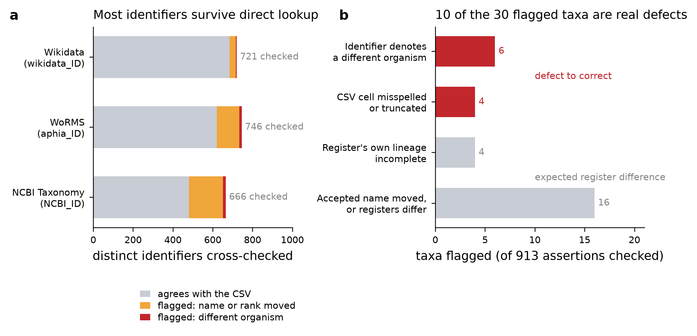

# External-authority verification of `planktonzilla_taxonomy.csv`

Generated by `planktonzilla/planktonzilla_dataset/utils/verify_taxonomy_ids.py`. This document is a
SNAPSHOT of what the automated cross-check reports; the authoritative, always-current statement is the
test suite `tests/test_taxonomy_authority_crosschecks.py`, which runs on every push.

## What is verified, and why it is not circular

`utils/extract_taxon_ids.py` filled `aphia_ID`, `NCBI_ID` and `BOLD_ID` by reading Wikidata claims
(P850 / P685 / P3606) off the Qcode it had matched for each taxon. No step ever asked WoRMS or NCBI
whether the identifier they were handed denotes the organism the row claims. This check does exactly
that: it resolves every identifier at its own register and compares the register's accepted name, rank
and full classification against the row's `proposed_label` and seven rank columns.

The lineage test is deliberately not a slot-for-slot comparison — WoRMS, NCBI and the CSV do not use the
same intermediate ranks. For each populated rank cell it asks *where that name sits in the register's
ancestor chain*: present at the same rank (agreement), present at a different rank (`rank_slot_drift`),
or absent from the chain entirely (`lineage_contradiction`). Only the third is evidence of a different
organism. Two bounds keep the test honest: the `Species` column holds a bare epithet, so the binomial is
the form looked up; and a chain cannot contain ranks below the identifier's own, so cells deeper than the
identifier are left to the coarseness check rather than reported as contradictions.

## Provenance

| | |
|---|---|
| snapshot generated | `2026-08-29T01:03:53+00:00` |
| taxonomy CSV | `planktonzilla_taxonomy.csv`, 2,358 rows, sha256 `95de6c499744b2a1…` |
| ncbi | 665/666 resolved — `https://eutils.ncbi.nlm.nih.gov/entrez/eutils/efetch.fcgi` |
| wikidata | 721/721 resolved — `https://www.wikidata.org/w/api.php` |
| worms | 746/746 resolved — `https://www.marinespecies.org/rest/AphiaRecordByAphiaID + AphiaClassificationByAphiaID` |

## Coverage

- **2,025 of 2,358 rows (85.9%)** carry at least one identifier a register can be asked about.
- The remaining **333** carry none. Most are non-taxonomic labels (`artefact`, `detritus`,
  `bad focus`) or coarse operational classes for which no register entry exists; a blank `aphia_ID` on a
  freshwater taxon is also expected, WoRMS being a marine register (KI-5).
- **2,133 distinct identifiers** were resolved, covering **913** distinct taxon assertions.
- `BOLD_ID` and `ecotaxa_ID` are **not** verified directly: BOLD publishes no stable by-identifier taxonomy
  record and EcoTaxa category ids are a project-level UI vocabulary, not a nomenclatural authority. BOLD is
  covered indirectly through Wikidata's P3606 round-trip.

## Results

2,331 findings: **59 ERROR**, **718 WARN**, **1554 INFO**.

| severity | check | n | meaning |
|---|---|---:|---|
| ERROR | `worms_lineage_contradiction` | 21 | a CSV rank name is absent from the AphiaID's WoRMS classification |
| ERROR | `ncbi_lineage_contradiction` | 18 | a CSV rank name is absent from the taxid's NCBI lineage |
| ERROR | `ncbi_name_mismatch` | 7 | the taxid names neither the label nor an NCBI synonym of it |
| ERROR | `authority_name_disagreement` | 5 | WoRMS and NCBI resolve the row's two identifiers to different organisms |
| ERROR | `wikidata_name_mismatch` | 5 | neither P225 nor the English label matches the label |
| ERROR | `worms_name_mismatch` | 2 | the AphiaID names neither the label nor its accepted synonym |
| ERROR | `ncbi_id_unresolved` | 1 | the taxid no longer exists at NCBI |
| WARN | `ncbi_id_coarser_than_label` | 120 | the taxid resolves to an ancestor of the labelled taxon |
| WARN | `id_reused_across_taxa` | 95 | one identifier is stamped on more than one distinct label |
| WARN | `ncbi_lineage_contradiction` | 90 | a CSV rank name is absent from the taxid's NCBI lineage |
| WARN | `wikidata_id_coarser_than_label` | 80 | the Qcode resolves to an ancestor of the labelled taxon |
| WARN | `ncbi_rank_slot_drift` | 79 | NCBI knows the name but places it at another rank |
| WARN | `worms_id_coarser_than_label` | 70 | the AphiaID resolves to an ancestor of the labelled taxon |
| WARN | `authority_depth_disagreement` | 57 | the two identifiers sit at different depths of the same lineage |
| WARN | `worms_rank_slot_drift` | 52 | WoRMS knows the name but places it at another rank |
| WARN | `worms_status_not_accepted` | 51 | the AphiaID is valid but its name has been superseded |
| WARN | `wikidata_ncbi_claim_divergence` | 11 | Wikidata now asserts a different NCBI id than the CSV holds |
| WARN | `wikidata_worms_claim_divergence` | 11 | Wikidata now asserts a different WoRMS id than the CSV holds |
| WARN | `wikidata_rank_mismatch` | 1 | P105 disagrees with the deepest populated CSV rank |
| WARN | `worms_rank_mismatch` | 1 | the AphiaID's rank differs from the deepest populated CSV rank |
| INFO | `ncbi_higher_rank_divergence` | 1,335 | expected: NCBI has no Chromista/Heterokontophyta, so higher ranks cannot match |
| INFO | `wikidata_ncbi_claim_absent` | 186 | the Qcode carries no NCBI claim, so the harvest cannot be replayed |
| INFO | `wikidata_worms_claim_absent` | 27 | the Qcode carries no WoRMS claim, so the harvest cannot be replayed |
| INFO | `worms_rank_outside_seven` | 6 | the AphiaID's rank has no column in the seven-rank schema |

### Two hand-found issues are now found automatically

- **KI-8** (rank-column contamination) — all five documented instances are reported as `rank_slot_drift`,
  alongside **18 further (name, rank-slot) combinations** the manual audit did not reach. 23 distinct
  combinations in total, firing 131 findings across 117 taxa.
- **KI-13** (one external id on two distinct taxa) — the single hand-found instance (NCBI 418941 on
  *Discosphaera tubifera* and *Rhabdosphaera clavigera*) is reported, and generalized to
  **95 over-used identifiers** across the three id columns.

## The ten defects worth correcting

Of the 30 taxa carrying an ERROR-severity finding, 20 are expected differences between registers
(nomenclature that has moved, or a register whose own classification is incomplete) and 10 are genuine
defects. All 59 findings are recorded in `AUTHORITY_WAIVERS.json`, categorized; nothing is silently
accepted. The table is frozen on HuggingFace Hub, so these are documented rather than edited in place.

| taxon | column at fault | what the register says | rows | datasets |
|---|---|---|---:|---|
| *actinosphaerium nucleofilum* | `aphia_ID` | aphia_ID 590589 is the family Actinophryidae, not the species, and WoRMS places that family outside the Actinosphaeriidae the row asserts. NCBI 238767 carries the correct species record | 1 | lensless |
| *ascomorpha* | `aphia_ID` | the CSV Family 'gastropoidae' is a misspelling: WoRMS places Ascomorpha in Gastropodidae and NCBI in Gastropidae. The genus identifier itself is correct in all three registers | 1 | frepj |
| *asterolamprales* | `NCBI_ID` | NCBI_ID 941245 no longer resolves to any taxon at NCBI Taxonomy; the taxid has been retired since the harvest | 4 | flowcamnet, planktoscope, tara_pacific_bongo, tara_pacific_decknet |
| *echidnophaga* | `aphia_ID` | aphia_ID 112045 is the foraminiferan genus Siphonaptera (Chromista > Foraminifera > Hauerinidae, itself unaccepted for Siphonaperta), not the flea order Siphonaptera the row sits under. A homonym collision picked the wrong register entry; NCBI 475928 and Q10479055 both correctly give the flea genus Echidnophaga | 1 | global_uvp5 |
| *haslea silbo* | `wikidata_ID` | wikidata_ID Q123283803 is the Wikidata item for the PAPER describing the species, not a taxon item: it has no P225 taxon name and no P105 rank. WoRMS 1782279 and NCBI 1146997 both give the species correctly | 1 | medplanktonset |
| *kapelodinium vestifici* | `wikidata_ID` | wikidata_ID Q25364681 is the genus Torodinium, the genus Kapelodinium was split out of, not the species. WoRMS 1368615 and NCBI 1890389 both give Kapelodinium vestifici correctly | 1 | medplanktonset |
| *radiozoa* | `NCBI_ID` | NCBI_ID 543769 is the clade Rhizaria, which WoRMS places one level ABOVE Radiozoa in the same chain, so the taxid names the parent rather than the row's taxon | 7 | jedioceans, medplanktonset, planktonset1.0, planktoscope |
| *simocephalus serrulatus* | `aphia_ID` | the CSV Family 'daphniida' is not a family name: WoRMS and NCBI both place Simocephalus in Daphniidae. The species identifiers are correct | 1 | frepj |
| *simocephalus vetulus* | `aphia_ID` | the CSV Family 'daphniida' is not a family name: WoRMS and NCBI both place Simocephalus in Daphniidae. The species identifiers are correct | 1 | frepj |
| *sinodiaptomus valkano* | `NCBI_ID, aphia_ID, wikidata_ID` | the CSV Species epithet is truncated: WoRMS 360601, NCBI 555049 and Q14343118 all give Sinodiaptomus valkanovi. The three identifiers are correct and mutually consistent; only the CSV label is wrong | 1 | frepj |

## Findings per source dataset

A finding is attributed to every source dataset whose rows carry the taxon, so one shared taxon counts
once per dataset.

| dataset | CSV rows | ERROR | WARN |
|---|---:|---:|---:|
| planktoscope | 266 | 17 | 102 |
| global_uvp5 | 254 | 11 | 23 |
| medplanktonset | 139 | 10 | 105 |
| frepj | 229 | 10 | 283 |
| syke_ifcb_2022 | 50 | 9 | 44 |
| whoi | 103 | 5 | 49 |
| daplankton | 44 | 5 | 27 |
| tara_pacific_decknet | 132 | 5 | 36 |
| tara_pacific_bongo | 137 | 4 | 23 |
| flowcamnet | 93 | 3 | 29 |
| tara_pacific_manta | 172 | 3 | 6 |
| zooscan | 120 | 2 | 11 |
| lensless | 10 | 2 | 8 |
| tara_pacific_hsn | 159 | 2 | 9 |
| planktonset1.0 | 121 | 1 | 9 |
| jedioceans | 95 | 1 | 2 |
| isiisnet | 32 | 0 | 0 |
| uvp6net | 54 | 0 | 1 |
| zoocamnet | 93 | 0 | 19 |
| zoolake | 35 | 0 | 13 |
| sykezooscan2024 | 20 | 0 | 9 |

## Re-running

```bash
# network stage: re-harvest all three registers into authority_snapshot.json
uv run python -m planktonzilla.planktonzilla_dataset.utils.verify_taxonomy_ids --refresh-snapshot

# network-free stage: cross-check the CSV against the committed snapshot
uv run python -m planktonzilla.planktonzilla_dataset.utils.verify_taxonomy_ids --report
```

Refresh the snapshot whenever the CSV changes (the suite fails if its sha256 no longer matches) or
periodically to pick up register revisions. A newly appearing finding arrives unwaived and turns
`tests/test_taxonomy_authority_crosschecks.py` red, which is the intended behaviour: it is reviewed, then
either fixed or waived with a justification.


